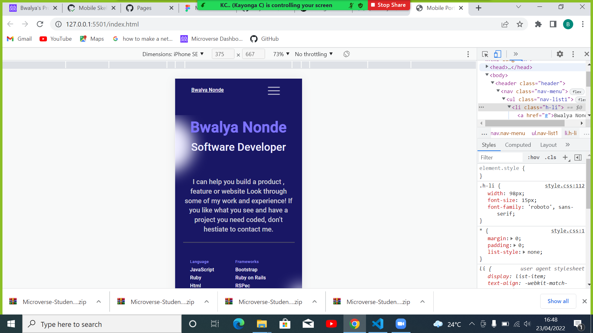
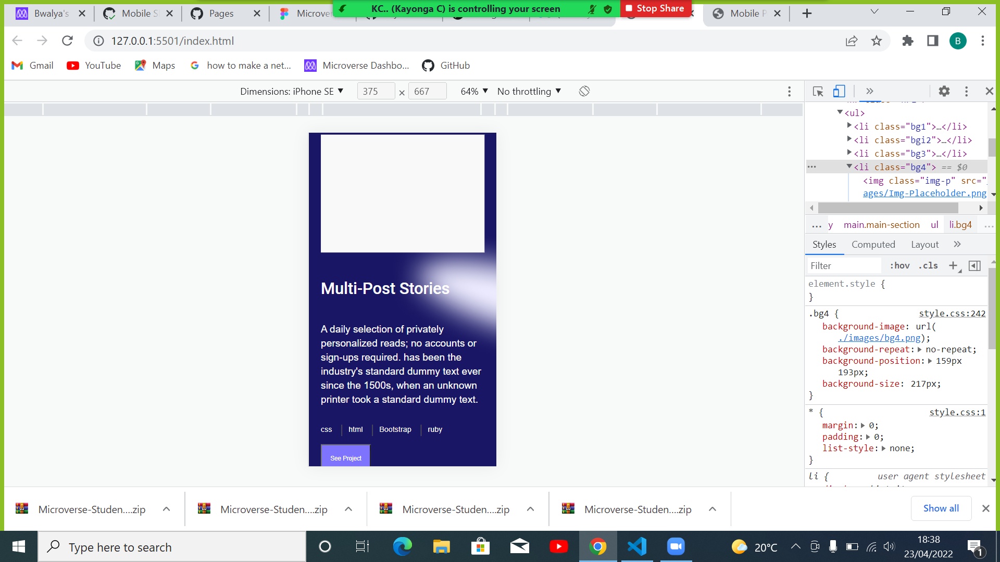

# Mobile-Version

> Mobile version Project For Microverse By Bwalya Nonde 

> This is a simple web develoment project for microverse created using simple HTML(Hyper text mark-up   Language.) and CSS(Cascading Style Sheet) which is used for styling or decorating the webpage.

## Built With

- html
- css

[Live Demo Link](https://bwalyanonde.github.io/Mobile-Portfolio/)

To get a local copy up and running follow these simple example steps.

## Author

👤 **Bwalya Nonde*

- GitHub: [@BwalyaNonde](https://github.com/BwalyaNonde)
- Twitter: [@BwalyaNonde](www.twittwwer.com)
- LinkedIn: [Bwalya Nonde](https://www.linkedin.com/in/bwalya-nonde-29a003142/)

## 🤝 Contributing

Contributions, issues, and feature requests are welcome!

Feel free to check the [issues page](../../issues/).

## Show your support

Give a ⭐️ if you like this project!

## Acknowledgments

- Hat tip to anyone whose code was used
- Inspiration
- etc

## 📝 License

This project is [MIT](./MIT.md) licensed.